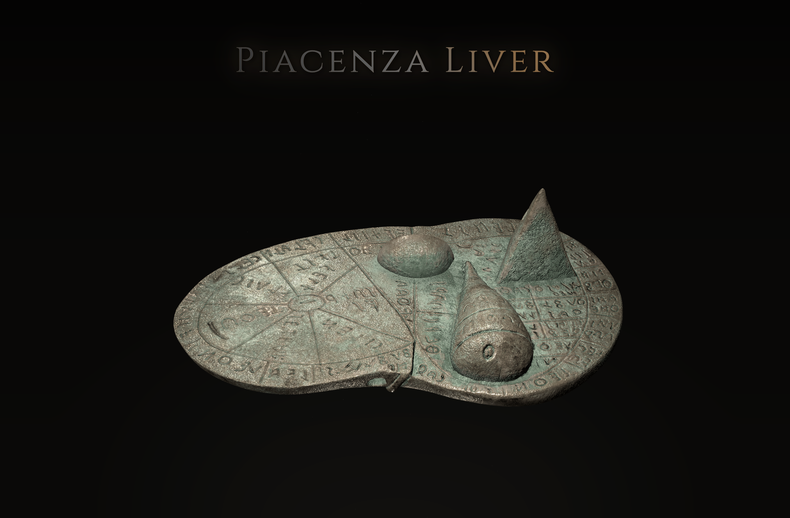

<div align="center">
  
</div>

An interactive 3D visualization of the ancient Etruscan Piacenza Liver (Fegato di Piacenza), a bronze model used for divination that maps the cosmological structure of Etruscan religious beliefs. This project presents all 42 authentic Etruscan inscriptions with transcriptions, deity mappings, and interpretive notes.

## ✨ Features

- **Interactive 3D Model**: Navigate around the bronze liver model with mouse/touch controls
- **Authentic Etruscan Script**: All 42 inscriptions displayed in original Etruscan Unicode characters (𐌀-𐌚)
- **Interpretive Notes**: Deity information, debated identifications, and archaeological context
- **Cosmological Grouping**: Organized by the nine zones used in the site's liver layout
- **Direct Linking**: Share specific inscriptions, regions, or deities with URL hash navigation

## 🔗 Direct Linking

You can link directly to specific content using URL hashes:

- **Inscription by ID**: `/inscriptions#1` - Scrolls to and highlights inscription #1
- **Region/Zone**: `/inscriptions#sky` or `/inscriptions#water` - Jumps to a specific cosmological region
- **Deity**: `/inscriptions#tinia` or `/inscriptions#uni` - Navigates to a specific deity section

Examples:
- `https://piacenzaliver.com/inscriptions#5` - View inscription 5
- `https://piacenzaliver.com/inscriptions#sky` - Explore the Sky region
- `https://piacenzaliver.com/inscriptions#tinia` - See all inscriptions mentioning Tinia

## 🌐 Live site

The site is served from **[piacenzaliver.com](https://piacenzaliver.com)** (canonical URL for links, SEO, and sharing). It is hosted on **GitHub Pages** from this repository. DNS runs on **Cloudflare** (apex uses GitHub’s documented A/AAAA records; `www` is a CNAME to `rasnastudios.github.io`). The previous hostname **liver.rasna.dev** should redirect to the `.com` domain at the edge (for example a Cloudflare Redirect Rule on the `rasna.dev` zone).

## 🚀 Run Locally

### Prerequisites

- [Node.js](https://nodejs.org/) (version 20 or higher)
- [pnpm](https://pnpm.io/) (recommended) or npm

### Installation

1. **Clone the repository:**
   ```bash
   git clone https://github.com/RasnaStudios/piacenza-liver.git
   cd piacenza-liver
   ```

2. **Install dependencies:**
   ```bash
   pnpm install
   ```
   *Or if using npm:*
   ```bash
   npm install
   ```

3. **Start the development server:**
   ```bash
   pnpm dev
   ```
   *Or if using npm:*
   ```bash
   npm run dev
   ```

4. **Open your browser:**
   Navigate to `http://localhost:5173` (or the URL shown in your terminal)

### Commands

- `pnpm build` — production build  
- `pnpm preview` — serve the production build locally  
- `pnpm lint` — lint and format check  

For segmentation assets, dataset generation, or recomputing inscription cameras, see **`scripts/`** (each script documents its own usage).

## 📱 Browser Compatibility

- Modern desktop browsers (Chrome, Firefox, Safari, Edge)
- Mobile browsers with WebGL support
- Optimized performance for both desktop and mobile devices

## 🤝 Contributing

Contributions are welcome! Please feel free to submit a Pull Request.

## 📄 License

This project is licensed under the MIT License - see the [LICENSE](LICENSE) file for details.
